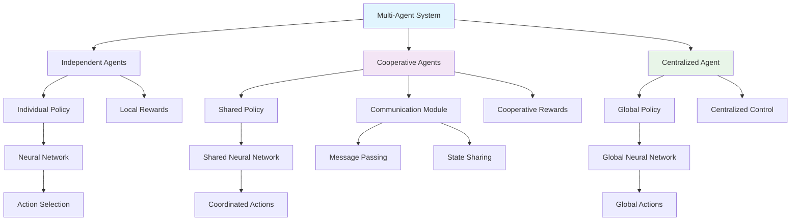

# Arquitetura dos Agentes MARL

## Diagrama de Arquitetura



## Fluxo de Decisão

### 1. Agente Independente
```
Observation → Policy Network → Action → Environment → Reward
     ↓           ↓            ↓         ↓           ↓
   Local State → Individual   → Local   → Step      → Local
                Learning      Action    Execution   Reward
```

### 2. Agente Cooperativo
```
Global State → Communication → Policy Network → Action → Environment → Reward
     ↓              ↓              ↓            ↓         ↓           ↓
  All Agents → Message Passing → Shared        → Coord-  → Step      → Coop-
   States     → State Sharing  → Learning      → inated  → Execution → erative
                               → Network       → Action               → Reward
```

### 3. Agente Centralizado
```
Global State → Central Policy → Global Action → Environment → Reward
     ↓           ↓             ↓         ↓         ↓           ↓
  All Agents → Centralized    → Control  → Step    → Global    → Global
   States    → Learning       → All      → Execu-  → State     → Reward
             → Network        → Agents   → tion    → Update
```

## Implementação das Classes

### BaseAgent

```python
class BaseAgent(ABC):
    """Classe base abstrata para agentes MARL"""

    def __init__(self, env, agent_id: int, config: Dict):
        """
        Args:
            env: Ambiente de simulação
            agent_id: ID único do agente
            config: Configurações do agente
        """
        self.env = env
        self.agent_id = agent_id
        self.config = config
        self.policy = None
        self.training_history = []
        self.communication_buffer = []

    @abstractmethod
    def select_action(self, observation: np.ndarray) -> np.ndarray:
        """Seleciona ação baseada na observação"""
        pass

    @abstractmethod
    def update_policy(self, experience: Tuple) -> None:
        """Atualiza política baseada na experiência"""
        pass

    def communicate(self, message: Dict) -> None:
        """Envia mensagem para outros agentes"""
        self.communication_buffer.append(message)

    def receive_messages(self) -> List[Dict]:
        """Recebe mensagens de outros agentes"""
        messages = self.communication_buffer.copy()
        self.communication_buffer.clear()
        return messages
```

### IndependentAgent

```python
class IndependentAgent(BaseAgent):
    """Agente que aprende independentemente"""

    def __init__(self, env, agent_id: int, config: Dict):
        super().__init__(env, agent_id, config)
        self.policy = self._create_policy()

    def _create_policy(self):
        """Cria política individual"""
        from stable_baselines3 import PPO

        return PPO(
            "MlpPolicy",
            self.env,
            learning_rate=self.config.get("learning_rate", 3e-4),
            verbose=0
        )

    def select_action(self, observation: np.ndarray) -> np.ndarray:
        """Seleciona ação individual"""
        action, _ = self.policy.predict(observation, deterministic=True)
        return action

    def update_policy(self, experience: Tuple) -> None:
        """Atualiza política com experiência"""
        obs, action, reward, next_obs, done = experience

        # Adicionar experiência ao buffer
        self.policy.replay_buffer.add(obs, action, reward, next_obs, done)

        # Atualizar se buffer estiver cheio
        if len(self.policy.replay_buffer) >= self.config.get("batch_size", 64):
            self.policy.train()
```

### CooperativeAgent

```python
class CooperativeAgent(BaseAgent):
    """Agente que coopera com outros agentes"""

    def __init__(self, env, agent_id: int, config: Dict, communication_protocol=None):
        super().__init__(env, agent_id, config)
        self.comm_protocol = communication_protocol
        self.policy = self._create_cooperative_policy()

    def _create_cooperative_policy(self):
        """Cria política cooperativa"""
        from stable_baselines3 import PPO

        # Política customizada para cooperação
        policy_kwargs = {
            "net_arch": [256, 256, 128],
            "activation_fn": nn.ReLU
        }

        return PPO(
            "MlpPolicy",
            self.env,
            policy_kwargs=policy_kwargs,
            learning_rate=self.config.get("learning_rate", 3e-4),
            verbose=0
        )

    def select_action(self, observation: np.ndarray) -> np.ndarray:
        """Seleciona ação considerando comunicação"""
        # Receber mensagens de outros agentes
        if self.comm_protocol:
            messages = self.comm_protocol.receive_messages(self.agent_id)
            communication_state = self._process_messages(messages)
        else:
            communication_state = None

        # Selecionar ação considerando comunicação
        if communication_state is not None:
            # Combinar observação com comunicação
            combined_obs = np.concatenate([observation, communication_state])
        else:
            combined_obs = observation

        action, _ = self.policy.predict(combined_obs, deterministic=True)
        return action

    def _process_messages(self, messages: List) -> np.ndarray:
        """Processa mensagens recebidas"""
        if not messages:
            return np.zeros(self.config.get("communication_dim", 32))

        # Agregar mensagens (simplificado)
        message_features = []
        for msg in messages:
            if isinstance(msg.content, np.ndarray):
                message_features.append(msg.content.flatten())
            else:
                message_features.append(np.array([msg.content]))

        if message_features:
            return np.concatenate(message_features)[:self.config.get("communication_dim", 32)]
        else:
            return np.zeros(self.config.get("communication_dim", 32))
```

### CentralizedAgent

```python
class CentralizedAgent(BaseAgent):
    """Agente centralizado que controla todos os prédios"""

    def __init__(self, env, agent_id: int, config: Dict):
        super().__init__(env, agent_id, config)
        self.policy = self._create_centralized_policy()

    def _create_centralized_policy(self):
        """Cria política centralizada"""
        from stable_baselines3 import PPO

        # Política para controle global
        policy_kwargs = {
            "net_arch": [512, 256, 128],
            "activation_fn": nn.ReLU
        }

        return PPO(
            "MlpPolicy",
            self.env,
            policy_kwargs=policy_kwargs,
            learning_rate=self.config.get("learning_rate", 3e-4),
            verbose=0
        )

    def select_action(self, observation: np.ndarray) -> np.ndarray:
        """Seleciona ações para todos os prédios"""
        # A observação já contém estado de todos os prédios
        actions, _ = self.policy.predict(observation, deterministic=True)
        return actions

    def update_policy(self, experience: Tuple) -> None:
        """Atualiza política centralizada"""
        obs, action, reward, next_obs, done = experience

        # Recompensa global (soma de todas as recompensas)
        global_reward = np.sum(reward) if isinstance(reward, np.ndarray) else reward

        # Adicionar experiência com recompensa global
        self.policy.replay_buffer.add(obs, action, global_reward, next_obs, done)

        # Atualizar se buffer estiver cheio
        if len(self.policy.replay_buffer) >= self.config.get("batch_size", 64):
            self.policy.train()
```

## Políticas Customizadas

### MultiAgentPolicy

```python
class MultiAgentPolicy(BasePolicy):
    """Política customizada para múltiplos agentes"""

    def __init__(self, observation_space, action_space, num_agents, communication_dim=0):
        super().__init__(observation_space, action_space)

        self.num_agents = num_agents
        self.communication_dim = communication_dim

        # Rede compartilhada
        self.shared_network = nn.Sequential(
            nn.Linear(observation_space.shape[0], 256),
            nn.ReLU(),
            nn.Linear(256, 128),
            nn.ReLU()
        )

        # Processamento de comunicação
        if communication_dim > 0:
            self.comm_network = nn.Sequential(
                nn.Linear(communication_dim, 64),
                nn.ReLU(),
                nn.Linear(64, 32)
            )

        # Cabeça da política
        input_dim = 128 + (32 if communication_dim > 0 else 0)
        self.action_network = nn.Linear(input_dim, action_space.shape[0])

    def forward(self, obs: torch.Tensor, communication: Optional[torch.Tensor] = None):
        """Forward pass da política"""
        # Processar observação
        features = self.shared_network(obs)

        # Processar comunicação se disponível
        if communication is not None:
            comm_features = self.comm_network(communication)
            combined = torch.cat([features, comm_features], dim=-1)
        else:
            combined = features

        # Gerar ação
        action = self.action_network(combined)
        return action
```

## Sistema de Recompensas

### Integração com Agentes

```python
class RewardIntegrator:
    """Integra diferentes tipos de recompensa com agentes"""

    def __init__(self, reward_function, agent_type="cooperative"):
        self.reward_function = reward_function
        self.agent_type = agent_type

    def calculate_agent_rewards(self, observations, actions, info):
        """Calcula recompensas para agentes"""
        if self.agent_type == "independent":
            return self._independent_rewards(observations, actions, info)
        elif self.agent_type == "cooperative":
            return self._cooperative_rewards(observations, actions, info)
        elif self.agent_type == "centralized":
            return self._centralized_rewards(observations, actions, info)

    def _independent_rewards(self, observations, actions, info):
        """Recompensas independentes"""
        return self.reward_function(observations, actions, info)

    def _cooperative_rewards(self, observations, actions, info):
        """Recompensas cooperativas"""
        # Usar função de recompensa cooperativa
        return self.reward_function(observations, actions, info)

    def _centralized_rewards(self, observations, actions, info):
        """Recompensa centralizada"""
        # Recompensa global para o agente centralizado
        global_reward = np.sum(self.reward_function(observations, actions, info))
        return np.array([global_reward])
```

## Comunicação entre Agentes

### MessageProtocol

```python
class MessageProtocol:
    """Protocolo de mensagens entre agentes"""

    def __init__(self, communication_type="full"):
        self.communication_type = communication_type
        self.message_queue = []

    def send_message(self, sender_id: int, receiver_id: int, content: Any):
        """Envia mensagem entre agentes"""
        message = {
            "sender": sender_id,
            "receiver": receiver_id,
            "content": content,
            "timestamp": time.time()
        }
        self.message_queue.append(message)

    def get_messages(self, agent_id: int) -> List[Dict]:
        """Obtém mensagens para um agente"""
        agent_messages = [msg for msg in self.message_queue
                         if msg["receiver"] == agent_id]

        # Remover mensagens processadas
        self.message_queue = [msg for msg in self.message_queue
                             if msg["receiver"] != agent_id]

        return agent_messages
```

## Configuração e Factory

### AgentFactory

```python
class AgentFactory:
    """Factory para criar agentes"""

    @staticmethod
    def create_agent(agent_type: str, env, agent_id: int, config: Dict, **kwargs):
        """Cria agente do tipo especificado"""
        if agent_type == "independent":
            return IndependentAgent(env, agent_id, config)
        elif agent_type == "cooperative":
            return CooperativeAgent(env, agent_id, config, **kwargs)
        elif agent_type == "centralized":
            return CentralizedAgent(env, agent_id, config)
        else:
            raise ValueError(f"Tipo de agente inválido: {agent_type}")

    @staticmethod
    def create_multi_agent_system(env, config: Dict):
        """Cria sistema multi-agente completo"""
        agent_type = config.get("agent_type", "independent")
        num_agents = env.num_buildings

        agents = []
        for i in range(num_agents):
            agent = AgentFactory.create_agent(agent_type, env, i, config)
            agents.append(agent)

        return agents
```

## Testes e Validação

### Testes Unitários

```python
def test_agent_creation():
    """Testa criação de agentes"""
    env = make_citylearn_vec_env()
    agent = IndependentAgent(env, 0, {})
    assert agent.agent_id == 0
    assert hasattr(agent, 'policy')

def test_action_selection():
    """Testa seleção de ações"""
    env = make_citylearn_vec_env()
    agent = IndependentAgent(env, 0, {})

    obs, info = env.reset()
    action = agent.select_action(obs)

    assert env.action_space.contains(action)

def test_cooperative_behavior():
    """Testa comportamento cooperativo"""
    env = make_citylearn_vec_env()
    comm_protocol = FullCommunication(env.num_buildings)
    agent = CooperativeAgent(env, 0, {}, comm_protocol)

    obs, info = env.reset()
    action = agent.select_action(obs)

    assert env.action_space.contains(action)
```

## Performance e Otimização

### Métricas

```python
def evaluate_agent(agent, env, num_episodes=10):
    """Avalia performance do agente"""
    rewards = []

    for episode in range(num_episodes):
        obs, info = env.reset()
        episode_reward = 0
        done = False

        while not done:
            action = agent.select_action(obs)
            obs, reward, done, info = env.step(action)
            episode_reward += reward

        rewards.append(episode_reward)

    return {
        "mean_reward": np.mean(rewards),
        "std_reward": np.std(rewards),
        "total_episodes": num_episodes
    }
```

### Otimizações

1. **Parameter Sharing**: Compartilhar parâmetros entre agentes similares
2. **Communication Compression**: Comprimir mensagens
3. **Batch Updates**: Atualizações em lote
4. **Experience Prioritization**: Priorizar experiências importantes

## Exemplos de Uso

### Treinamento Independente

```python
# Criar ambiente e agente
env = make_citylearn_vec_env("citylearn_challenge_2022_phase_1")
agent = IndependentAgent(env, 0, {})

# Treinamento
for episode in range(1000):
    obs, info = env.reset()
    done = False
    episode_reward = 0

    while not done:
        action = agent.select_action(obs)
        obs, reward, done, info = env.step(action)
        agent.update_policy((obs, action, reward, obs, done))
        episode_reward += reward

    print(f"Episode {episode}: Reward = {episode_reward}")
```

### Treinamento Cooperativo

```python
# Criar ambiente e agentes cooperativos
env = make_citylearn_vec_env("citylearn_challenge_2022_phase_1")
comm_protocol = FullCommunication(env.num_buildings)
agents = [CooperativeAgent(env, i, {}, comm_protocol) for i in range(env.num_buildings)]

# Treinamento cooperativo
for episode in range(1000):
    obs, info = env.reset()
    done = False
    episode_reward = 0

    while not done:
        # Cada agente recebe comunicação
        actions = []
        for agent in agents:
            messages = comm_protocol.receive_messages(agent.agent_id)
            action = agent.select_action(obs, messages)
            actions.append(action)

            # Enviar estado para comunicação
            comm_protocol.send_message(agent.agent_id, "all", obs)

        obs, rewards, done, info = env.step(actions)

        # Atualizar todos os agentes
        for i, agent in enumerate(agents):
            agent.update_policy((obs, actions[i], rewards[i], obs, done))

        episode_reward += sum(rewards)

    print(f"Episode {episode}: Total Reward = {episode_reward}")
```

## Troubleshooting

### Problemas Comuns

1. **Espaços incorretos**: Verificar se os espaços de observação/ação estão corretos
2. **Recompensas NaN**: Verificar se a função de recompensa está retornando valores válidos
3. **Convergência lenta**: Ajustar hiperparâmetros de aprendizado
4. **Exploração insuficiente**: Aumentar ent_coef para PPO

### Debugging

```python
# Logging detalhado
import logging
logging.basicConfig(level=logging.DEBUG)

# Verificar ações
action = agent.select_action(obs)
print(f"Action: {action}, Valid: {env.action_space.contains(action)}")

# Verificar recompensas
reward = env.step(action)[1]
print(f"Reward: {reward}")