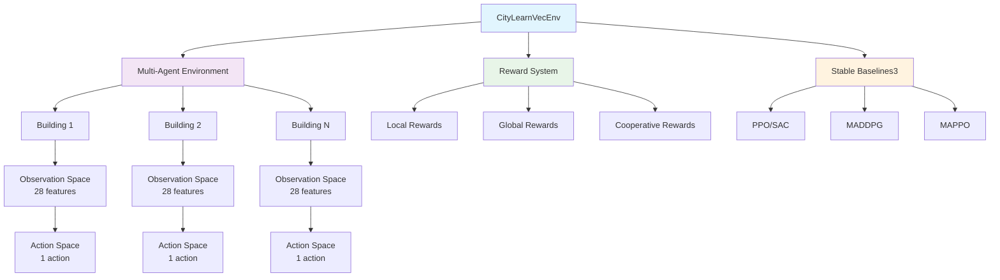

# Arquitetura do Ambiente Vetorizado CityLearn

## Diagrama de Arquitetura



## Fluxo de Dados

### 1. Observações
```
Individual Building State (28 features each):
├── Temporal: hour, day_type, month
├── Energetic: consumption, generation, storage
├── Economic: pricing, tariffs
├── Climatic: temperature, humidity, solar
└── Building: indoor conditions, HVAC state

Global State (N_buildings × 28 features):
├── Concatenated observations from all buildings
├── Shared information (pricing, grid status)
└── Communication signals between agents
```

### 2. Ações
```
Individual Actions (1 per building):
├── HVAC control: [-0.78125, 0.78125]
├── Storage management
└── Load shifting

Joint Actions (N_buildings):
├── Simultaneous execution
├── Coordination mechanisms
└── Conflict resolution
```

### 3. Recompensas
```
Reward Components:
├── Comfort: temperature deviation penalty
├── Cost: electricity pricing penalty
├── Peak: demand peak penalty
├── Cooperation: coordination bonus
└── Efficiency: energy efficiency bonus
```

## Interface com Stable Baselines3

```python
class CityLearnVecEnv(gymnasium.Env):
    def __init__(self, dataset_name, reward_type="cooperative"):
        # Initialize CityLearn environment
        # Setup multi-agent wrapper
        # Configure reward function

    def reset(self, **kwargs):
        # Reset all buildings
        # Return concatenated observations
        # Return info dictionary

    def step(self, actions):
        # Distribute actions to buildings
        # Execute environment step
        # Calculate cooperative rewards
        # Return observations, rewards, done, info

    def render(self, mode="human"):
        # Visualize building states
        # Show energy flows
        # Display performance metrics
```

## Configurações de Recompensa

### 1. Recompensa Local
```
R_local = - (comfort_penalty + cost_penalty)
```

### 2. Recompensa Global
```
R_global = - (total_cost + peak_penalty + carbon_emissions)
```

### 3. Recompensa Cooperativa
```
R_cooperative = w1 * R_local + w2 * R_global + cooperation_bonus
```

## Comunicação entre Agentes

### 1. Estado Compartilhado
- Todos os agentes veem o estado completo
- Informação sobre ações dos outros agentes
- Estado global da rede elétrica

### 2. Canais de Comunicação
- **Broadcast**: Todos os agentes enviam para todos
- **Neighborhood**: Comunicação local entre prédios próximos
- **Centralized**: Comunicação através de um agente central

### 3. Protocolos de Coordenação
- **Consensus**: Acordo sobre ações conjuntas
- **Leader-Follower**: Um agente lidera, outros seguem
- **Market-based**: Negociação de recursos energéticos

## Vetorização

### 1. DummyVecEnv
```
Single Process:
├── Sequential execution
├── Shared memory
└── Synchronous updates
```

### 2. SubprocVecEnv
```
Multiple Processes:
├── Parallel execution
├── Process isolation
├── Asynchronous updates
└── Inter-process communication
```

## Performance Otimizações

### 1. Memória
- Pre-allocation de arrays numpy
- Efficient concatenation de observações
- Shared memory entre processos

### 2. Computação
- Vectorized operations
- Batch processing de recompensas
- Parallel computation de métricas

### 3. I/O
- Lazy loading de datasets
- Caching de cálculos frequentes
- Async I/O para logging

## Testes e Validação

### 1. Testes Unitários
```python
def test_environment_creation():
    env = CityLearnVecEnv("citylearn_challenge_2022_phase_1")
    assert env.num_buildings == 5
    assert env.observation_space.shape == (140,)  # 5 * 28

def test_reward_functions():
    env = CityLearnVecEnv(reward_type="cooperative")
    obs = env.reset()
    actions = env.action_space.sample()
    obs, rewards, done, info = env.step(actions)
    assert len(rewards) == 5  # One reward per building
```

### 2. Testes de Integração
```python
def test_sb3_compatibility():
    env = CityLearnVecEnv("citylearn_challenge_2022_phase_1")
    from stable_baselines3.common.env_checker import check_env
    check_env(env)  # Should pass without errors

def test_training_loop():
    env = CityLearnVecEnv("citylearn_challenge_2022_phase_1")
    model = PPO("MlpPolicy", env, verbose=0)
    model.learn(total_timesteps=1000)
    # Should complete without errors
```

## Métricas de Desempenho

### 1. Eficiência Energética
```
Energy Efficiency = Total Energy Consumed / Total Energy Generated
Target: Minimize consumption, maximize renewable usage
```

### 2. Balanceamento da Rede
```
Load Factor = Average Demand / Peak Demand
Target: Maximize load factor (flatten demand curve)
```

### 3. Conforto dos Usuários
```
Comfort Score = 1 - (Temperature Deviation / Comfort Range)
Target: Maintain temperature within comfort bounds
```

### 4. Custos Operacionais
```
Total Cost = Electricity Cost + Peak Demand Charges + Carbon Tax
Target: Minimize operational expenses
```

## Extensibilidade

### 1. Novos Datasets
- Suporte automático a novos datasets CityLearn
- Configuração automática de espaços
- Adaptação de funções de recompensa

### 2. Algoritmos Adicionais
- Interface genérica para diferentes algoritmos MARL
- Suporte a custom policies
- Integration com RLlib e outros frameworks

### 3. Funcionalidades Avançadas
- Multi-objective optimization
- Constraint satisfaction
- Safe reinforcement learning
- Transfer learning entre datasets